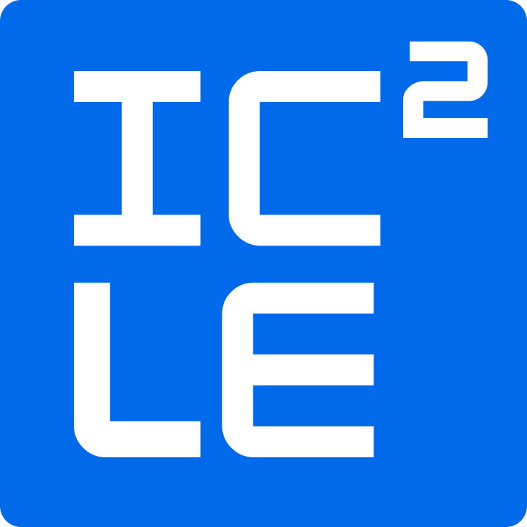

# OPEN-ICICLE

<div align="center">
  ICICLE is a high-performance cryptographic acceleration library designed to optimize cryptographic computations across various hardware platforms, including CPUs, GPUs, and other accelerators.
</div>

> [!IMPORTANT]
> **Scope of this open-icicle distribution.** This repository is a trimmed distribution of ICICLE that ships **only** the following primitives:
> - **MSM** (multi-scalar multiplication)
> - **NTT** (number-theoretic transform)
> - **ECNTT** (NTT over elliptic curve points)
> - The supporting scalar/point field, vector, and runtime operations required by the above
>
> Only the **BN254** and **BLS12-381** curves are supported. Other curves (BLS12-377, BW6-761, Grumpkin), prime fields (babybear, stark252, m31, koalabear), and primitives outside the list above (e.g. Poseidon, Merkle trees, polynomial APIs, sumcheck) are **not** included in this distribution. Where the upstream ICICLE documentation references those, they do not apply here.

<p align="center">
  <br>
  
</p>

<p align="center">
  <br>
  <br>
  <a href="https://discord.gg/EVVXTdt6DF">
    
  </a>
  <a href="https://www.linkedin.com/company/ingonyama">
    
  </a>
  <a href="https://x.com/Ingo_zk">
    
  </a>
  <a href="https://github.com/ingonyama-zk/open-icicle/releases">
    
  </a>
</p>


## Background

Zero Knowledge Proofs (ZKPs) are considered one of the greatest achievements of modern cryptography. Accordingly, ZKPs are expected to disrupt a number of industries and will usher in an era of trustless and privacy preserving services and infrastructure.

We believe that ICICLE will be a cornerstone in the acceleration of ZKPs:

- **Versatility**: Supports multiple hardware platforms, making it adaptable to various computational environments.
- **Efficiency:** Designed to leverage the parallel nature of ZK computations, whether on GPUs, CPUs, or other accelerators.
- **Scalability:** Provides an easy-to-use and scalable solution for developers, allowing them to optimize cryptographic operations with minimal effort.

This open-icicle distribution focuses that capability on a specific surface: accelerated **MSM**, **NTT**, and **ECNTT** (plus their supporting field and vector operations) on the **BN254** and **BLS12-381** curves.

## Getting Started

This guide will help you get started with ICICLE in C++, Rust, and Go.

> [!NOTE]
> **Developers**: We highly recommend reading our [documentation](https://dev.ingonyama.com/) for a comprehensive explanation of ICICLE’s capabilities.

> [!TIP]
> Try out ICICLE by running some [examples] available in C++, Rust, and Go bindings. Check out our install-and-use examples in [C++](https://github.com/ingonyama-zk/open-icicle/tree/main/examples/c%2B%2B/install-and-use-icicle), [Rust](https://github.com/ingonyama-zk/open-icicle/tree/main/examples/rust/install-and-use-icicle) and [Go](TODO)

### Prerequisites

- Any compatible hardware: ICICLE supports various hardware, including CPUs, Nvidia GPUs, and other accelerators.
- [CMake](https://cmake.org/files/), Version 3.18 or above. Latest version recommended. Required only if building from source.
- [CUDA Toolkit](https://developer.nvidia.com/cuda-downloads), Required only if using NVIDIA GPUs (version 12.0 or newer).

> [!NOTE]
> For older GPUs that only support CUDA 11, ICICLE may still function, but official support is for CUDA 12 onwards.


### Accessing Hardware

If you don't have access to an Nvidia GPU we have some options for you.
 
[Google Colab](https://colab.google/) offers a free [T4 GPU](https://www.nvidia.com/en-us/data-center/tesla-t4/) instance and ICICLE can be used with it, reference this guide for setting up your [Google Colab workplace][GOOGLE-COLAB-ICICLE].

If you require more compute and have an interesting research project, we have [bounty and grant programs][GRANT_PROGRAM].

## Building ICICLE from source

ICICLE provides build systems for C++, Rust, and Go. Each build system incorporates the core ICICLE library, which contains the essential cryptographic primitives. Refer to the [Getting started page](https://dev.ingonyama.com/icicle/build_from_source) for full details about building and using ICICLE.

> [!WARNING]
> Ensure ICICLE libraries are installed correctly when building or installing a library/application that depends on ICICLE so that they can be located at runtime.

### Rust

In cargo.toml, specify the ICICLE libs to use:

```bash
[dependencies]
icicle-runtime = { git = "https://github.com/ingonyama-zk/open-icicle.git", branch="main" }
icicle-core = { git = "https://github.com/ingonyama-zk/open-icicle.git", branch="main" }
icicle-babybear = { git = "https://github.com/ingonyama-zk/open-icicle.git", branch="main" }
# add other ICICLE crates here if need additional fields/curves
```

You can specify `branch=branch-name`, `tag=tag-name`, or `rev=commit-id`.

Build the Rust project:

```bash
cargo build --release
```

### Go

There are two ways to build from source in Go:

1. Clone the repo, update your go.mod to point to the local clone, and build ICICLE within the clone

```sh
git clone https://github.com/ingonyama-zk/open-icicle.git
```

Add ICICLE v3 to your go.mod file:

```go
require github.com/ingonyama-zk/open-icicle/v3 v3.0.0

replace github.com/ingonyama-zk/open-icicle/v3 => ../path/to/cloned/icicle
```

Navigate to the cloned repo's golang bindings and build the library using the supplied [build script][ICICLE-GO-BUILD-SCRIPT]

```sh
cd icicle/wrappers/golang
chmod +x build.sh
./build.sh -curve=bn254
```

2. Update your go.mod to include ICICLE as a dependency, navigate to the dependency in your GOMODCACHE and build ICICLE there

```sh
go get github.com/ingonyama-zk/open-icicle/v3
cd $(go env GOMODCACHE)/github.com/ingonyama-zk/open-icicle/v3@<version>/wrappers/golang
chmod +x build.sh
./build.sh -curve=bn254
```

> [!NOTE]
> In this open-icicle distribution, only curves are supported. Use the flag -curve=<curve>, where <curve> is one of: bn254, bls12_381.
> Prime fields (babybear, stark252, m31, koalabear) and other curves (bls12_377, bw6_761, grumpkin) are not included.

Once ICICLE has been built, you can add specific packages when you need them in your application:

```go
import (
  runtime "github.com/ingonyama-zk/open-icicle/v3/wrappers/golang/runtime"
  core "github.com/ingonyama-zk/open-icicle/v3/wrappers/golang/core"
  bn254 "github.com/ingonyama-zk/open-icicle/v3/wrappers/golang/curves/bn254"
  bn254MSM "github.com/ingonyama-zk/open-icicle/v3/wrappers/golang/curves/bn254/msm"
)
```

### C++

ICICLE can be built and tested in C++ using CMake. The build process is straightforward, but there are several flags you can use to customize the build for your needs.

**Clone the ICICLE repository:**

```bash
git clone https://github.com/ingonyama-zk/open-icicle.git
cd icicle
```

**Configure the build:**

```bash
mkdir -p build && rm -rf build/*
cmake -S icicle -B build -DCURVE=bn254
```

> [!NOTE]
> In this open-icicle distribution, only curves are supported. Use the flag -DCURVE=curve, where curve is one of: bn254, bls12_381.
> Prime fields (babybear, stark252, m31, koalabear) and other curves (bls12_377, bw6_761, grumpkin) are not included.

**Build the project:**

```bash
cmake --build build -j # -j is for multi-core compilation
```

**Link your application (or library) to ICICLE:**

```cmake
target_link_libraries(yourApp PRIVATE icicle_curve_bn254 icicle_device)
```

**Install (optional):**

To install the libs, specify the install prefix `-DCMAKE_INSTALL_PREFIX=/install/dir/`. Then after building, use cmake to install the libraries:

```sh
cmake -S icicle -B build -DCURVE=bn254 -DCMAKE_INSTALL_PREFIX=/path/to/install/dir/
cmake --build build -j # build
cmake --install build # install icicle to /path/to/install/dir/
```

**Run tests (optional):**

> [!CAUTION]
> Most tests assume a CUDA backend exists and will fail otherwise, if a CUDA device is not found.

Add `-DBUILD_TESTS=ON` to the cmake command, build and execute tests:

```bash
cmake -S icicle -B build -DCURVE=bn254 -DBUILD_TESTS=ON
cmake --build build -j
cd build/tests
ctest
```

or choose the test-suite

```bash
./build/tests/test_curve_api # or another test suite
# can specify tests using regex. For example for tests with ntt in the name:
./build/tests/test_curve_api --gtest_filter="*ntt*"
```

**Build Flags:**

You can customize your ICICLE build with the following flags:

- `-DCPU_BACKEND=ON/OFF`: Enable or disable built-in CPU backend. `default=ON`.
- `-DCMAKE_INSTALL_PREFIX=/install/dir`: Specify install directory. `default=/usr/local`.
- `-DBUILD_TESTS=ON/OFF`: Enable or disable tests. `default=OFF`.
- `-DBUILD_BENCHMARKS=ON/OFF`: Enable or disable benchmarks. `default=OFF`.

## Install CUDA backend

To install the CUDA backend

1. [Download the release binaries](https://github.com/ingonyama-zk/open-icicle/releases/).
2. Install it, by extracting the binaries to `/opt/` or any other custom install path.
3. In your application, load the cuda backend and select a CUDA device.
4. All subsequent API will now use the selected device.


Rust:

```rust
use icicle_runtime::{runtime, Device};

runtime::load_backend_from_env_or_default().unwrap();
// or load programmatically
runtime::load_backend("/path/to/backend/installdir").unwrap();
// Select CUDA device
let device = Device::new("CUDA", 1 /*gpu-id*/);
icicle_runtime::set_device(&device).unwrap();

// Any call will now execute on GPU-1
```

Go:

```go
import(
  "github.com/ingonyama-zk/open-icicle/v3/wrappers/golang/runtime"
)

result := runtime.LoadBackendFromEnvOrDefault()
// or load from custom install dir
result := runtime.LoadBackend("/path/to/backend/installdir", true)
// Select CUDA device
device := runtime.CreateDevice("CUDA", 0) // or other
result := runtime.SetDevice(device)

// Any call will now execute on GPU-0
```
C++:

```cpp
#include "icicle/runtime.h"

// Load the installed backend
eIcicleError result = icicle_load_backend_from_env_or_default();
// or load it programmatically
eIcicleError result = icicle_load_backend("/path/to/backend/installdir", true);

// Select CUDA device
icicle::Device device = {"CUDA", 0 /*gpu-id*/};
eIcicleError result = icicle_set_device(device);

// Any call will now execute on GPU-0
```

Full details can be found in our [getting started docs](https://dev.ingonyama.com/icicle/getting_started)

## Contributions

Join our [Discord Server][DISCORD] and find us on the ICICLE channel. We will be happy to work together to support your use case, and talk features, bugs and design.

### Development Contributions

If you are changing code, please make sure to change your [git hooks path][HOOKS_DOCS] to the repo's [hooks directory][HOOKS_PATH] by running the following command:

```sh
git config core.hooksPath ./scripts/hooks
```

In case `clang-format` is missing on your system, you can install it  using the following command:

```sh
sudo apt install clang-format
```

You will also need to install [codespell](https://github.com/codespell-project/codespell?tab=readme-ov-file#installation) to check for typos.

This will ensure our custom hooks are run and will make it easier to follow our coding guidelines.

## Help & Support

For help and support talk to our devs in our discord channel [#ICICLE](https://discord.gg/EVVXTdt6DF) or contact us at <support@ingonyama.com>.

## License

ICICLE frontend is distributed under the terms of the MIT License.

> [!NOTE]
> ICICLE backends, excluding the CPU backend, are distributed under a special license and are not covered by the MIT license.

See [LICENSE-MIT][LMIT] for details.

<!-- Begin Links -->
[BLS12-381]: ./icicle/curves/
[BN254]: ./icicle/curves/
[LMIT]: ./LICENSE
[DISCORD]: https://discord.gg/Y4SkbDf2Ff
[googletest]: https://github.com/google/googletest/
[HOOKS_DOCS]: https://git-scm.com/docs/githooks
[HOOKS_PATH]: ./scripts/hooks/
[GOOGLE-COLAB-ICICLE]: https://dev.ingonyama.com/icicle/colab-instructions
[GRANT_PROGRAM]: https://medium.com/@ingonyama/icicle-for-researchers-grants-challenges-9be1f040998e
[ICICLE-CORE]: ./icicle/
[ICICLE-RUST]: ./wrappers/rust/
[ICICLE-GO]: ./wrappers/golang/
[ICICLE-GO-BUILD-SCRIPT]: ./wrappers/golang/build.sh
[ICICLE-CORE-README]: ./icicle/README.md
[ICICLE-RUST-README]: ./wrappers/rust/README.md
[ICICLE-GO-README]: ./wrappers/golang/README.md
[documentation]: https://dev.ingonyama.com/icicle/overview
[examples]: ./examples/

<!-- End Links -->
